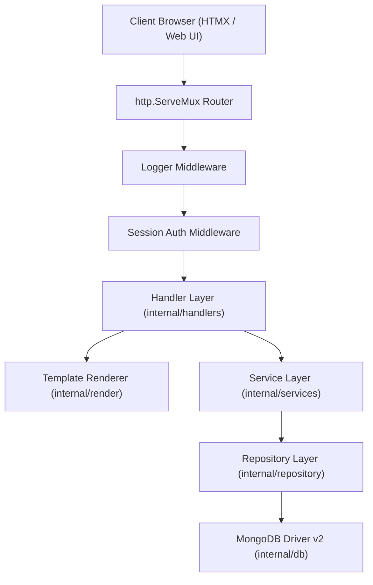

# Architecture & Routing Reference Guide

This document details the internal architecture, request handling lifecycle, dependency injection model, middleware pipeline, and template rendering system of the **Wedrink EOD Report System**.

---

## 1. Application Layer Hierarchy & Package Responsibilities

The codebase strictly adheres to **Clean Architecture** separation of concerns using Go standard library components:



### Layer Breakdown

1. **Entry Point (`cmd/server/main.go`)**:
   - Reads environment configuration using `internal/config`.
   - Initializes structured logging with `internal/utils`.
   - Establishes database connection with `internal/db`.
   - Constructs repositories (`UserRepository`, `ReportRepository`).
   - Automatically seeds default demo users.
   - Instantiates services (`AuthService`, `ReportService`).
   - Registers template helper functions (`FuncMap`) and constructs `render.Renderer`.
   - Sets up HTTP router (`http.NewServeMux`) with path-based routing (Go 1.22+ routing syntax e.g., `GET /{$}`, `DELETE /reports/delete`).
   - Wraps router with session middleware and logger middleware.
   - Starts HTTP server with graceful shutdown handling on `SIGINT` / `SIGTERM`.

2. **Configuration (`internal/config/config.go`)**:
   - Parses `.env` key-value pairs manually using scanner (no external dependency required).
   - Reads environment variables with defaults:
     - `PORT`: Default `8080`
     - `MONGO_URI`: Default `mongodb://localhost:27017`
     - `MONGO_DB_NAME`: Default `wedrink`
     - `SESSION_SECRET`: Default `wedrink-secret-session-key-2026-change-me`
     - `ENV`: Default `development`

3. **HTTP Middleware Pipeline (`internal/middleware/`)**:
   - **`SessionManager.AuthMiddleware`**: Decodes `wedrink_session` cookie formatted as `username|role|fullname`. Injects `*models.User` into `r.Context()` with key `UserContextKey ("user")`.
   - **`RequireAuth`**: Verifies user presence in context. If unauthenticated:
     - Standard HTTP request $\rightarrow$ Redirects (`303 See Other`) to `/login`.
     - HTMX request (`HX-Request: true`) $\rightarrow$ Returns `401 Unauthorized` with header `HX-Redirect: /login`.
   - **`RequireRole`**: High-order middleware accepting allowed `models.Role`s. If user role does not match:
     - Standard HTTP request $\rightarrow$ Returns `403 Forbidden` text error.
     - HTMX request $\rightarrow$ Sets `HX-Reswap: outerHTML` and returns a stylized red alert HTML fragment explaining missing Manager privileges.
   - **`Logger`**: Wraps `http.ResponseWriter` with a status capturer to log request method, path, status code, latency, and remote IP using `log/slog`.

---

## 2. Full HTTP Route Map

| Method | Path | Access Level | Handler Function | Response Type |
| --- | --- | --- | --- | --- |
| `GET` | `/static/` | Public | Standard FileServer | Static file stream with `no-cache` headers |
| `GET` | `/health` | Public | Inline JSON func | JSON status object |
| `GET` | `/login` | Public | `AuthHandler.RenderLogin` | Full HTML page (`login.html`) |
| `POST` | `/login` | Public | `AuthHandler.HandleLogin` | Form redirect or HTMX redirect header |
| `POST` | `/logout` | Authenticated | `AuthHandler.HandleLogout` | Clears cookie, redirects to `/login` |
| `GET` | `/{$}` | Authenticated | `DashboardHandler.RenderDashboard` | Full HTML page (`dashboard.html` + `dashboard_content.html`) |
| `GET` | `/submit` | Authenticated | `ReportHandler.RenderSubmitForm` | Full HTML page (`submit.html`) |
| `POST` | `/reports/preview` | Authenticated | `ReportHandler.RenderCalculationPreview` | HTMX Fragment (`calculation_preview.html`) |
| `GET` | `/reports/expense-row` | Authenticated | `ReportHandler.RenderExpenseRow` | HTMX Fragment (`expense_row.html`) |
| `POST` | `/reports` | Authenticated | `ReportHandler.HandleSubmit` | HTMX Fragment (`alert_success.html` / `alert_error.html`) |
| `GET` | `/reports` | Manager Only | `ReportHandler.RenderReportsList` | Full HTML (`reports.html`) or HTMX table (`report_table.html`) |
| `GET` | `/reports/detail` | Manager Only | `ReportHandler.RenderDetailModal` | HTMX Fragment (`report_modal.html`) |
| `GET` | `/reports/edit` | Manager Only | `ReportHandler.RenderEditForm` | Full HTML page (`submit.html` populated for edit) |
| `DELETE` / `POST` | `/reports/delete` | Manager Only | `ReportHandler.HandleDelete` | HTMX fragment / list re-render |
| `GET` | `/export/csv` | Manager Only | `ExportHandler.ExportCSV` | File attachment `text/csv` |

---

## 3. Dependency Injection & Service Composition

In `main.go`, dependencies are wired sequentially without reflection or magic containers:

```go
// 1. Storage Drivers
mongoDB, _ := db.Connect(cfg)

// 2. Repositories
userRepo := repository.NewUserRepository(mongoDB.Database)
reportRepo := repository.NewReportRepository(mongoDB.Database)

// 3. Domain Services
authService := services.NewAuthService(userRepo)
reportService := services.NewReportService(reportRepo)

// 4. View Renderer
renderer, _ := render.NewRenderer(funcMap)

// 5. HTTP Handlers
authHandler := handlers.NewAuthHandler(authService, renderer)
reportHandler := handlers.NewReportHandler(reportService, renderer)
dashboardHandler := handlers.NewDashboardHandler(reportService, renderer)
exportHandler := handlers.NewExportHandler(reportService)
```

This guarantees testability, compile-time safety, and clear service boundaries.
