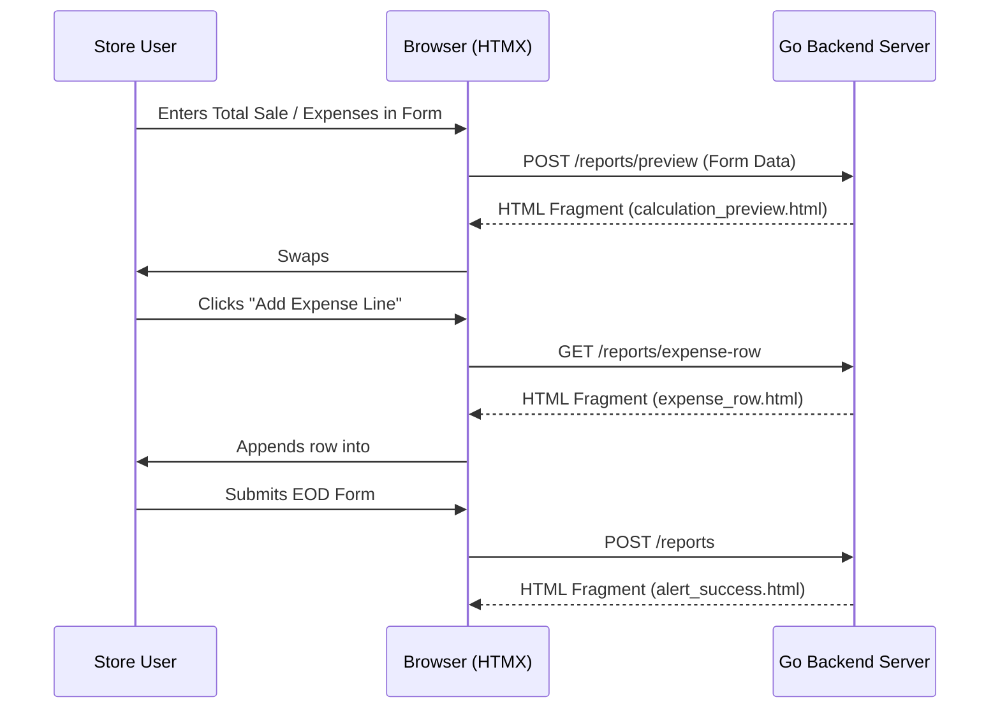

# HTMX & Frontend Dynamic Component Guide

This document details the frontend architecture, HTMX dynamic endpoints, CSS glassmorphism design system, modal rendering, and CSV export streaming in **Wedrink**.

---

## 1. HTMX Integration Architecture

Wedrink uses **HTMX 2.0** (`web/static/js/app.js` and standard HTMX attributes) to achieve SPA-like fluidity without heavy frontend frameworks like React or Vue.

### Core HTMX Workflow Endpoints

---

## 2. Dynamic HTMX Endpoints & Component Templates

### A. Live Calculation Preview
- **Route**: `POST /reports/preview`
- **Trigger**: Form field changes (`hx-post="/reports/preview" hx-trigger="keyup delay:300ms, change" hx-target="#live-preview-box"`)
- **Template**: `web/templates/components/calculation_preview.html`
- **Output**: Real-time calculation of Expected Cash, Total Expenses, and Net Discrepancy badge before committing to DB.

### B. Dynamic Expense Rows
- **Route**: `GET /reports/expense-row`
- **Trigger**: Button click (`hx-get="/reports/expense-row" hx-target="#expense-container" hx-swap="beforeend"`)
- **Template**: `web/templates/components/expense_row.html`
- **Output**: Renders an itemized expense input row with a delete button (`onclick="this.closest('.expense-row').remove()"`).

### C. Report Detail Modal
- **Route**: `GET /reports/detail?id=ID` (Manager only)
- **Trigger**: Row click in report table (`hx-get="/reports/detail" hx-target="#modal-container"`)
- **Template**: `web/templates/report_modal.html`
- **Output**: Pops open glassmorphism modal showing full report metadata and itemized expense breakdown list.

---

## 3. Glassmorphism CSS Design System (`web/static/css/style.css`)

The UI is built with a custom dark-mode Glassmorphism design system:

### Key Design Tokens & Classes
- **Background Gradient**: Deep Midnight Slate (`#0f172a` to `#1e1b4b`).
- **Glass Cards (`.glass-card`)**:
  - `background: rgba(30, 41, 59, 0.7)`
  - `backdrop-filter: blur(16px)`
  - `border: 1px solid rgba(255, 255, 255, 0.1)`
  - `box-shadow: 0 8px 32px 0 rgba(0, 0, 0, 0.37)`
- **Input Controls (`.glass-input`)**:
  - Translucent input boxes with glowing focus borders (`#6366f1`).
- **Discrepancy Badges (`.badge`)**:
  - Balanced Match: Green Emerald glow
  - Shortage: Rose Red glow
  - Surplus: Amber Gold glow

---

## 4. Multi-Mode CSV Data Export (`internal/handlers/export_handler.go`)

Managers can export store reconciliation records via `GET /export/csv`:

### Export Query Parameters
1. **`export=summary`** (Default):
   Exports overall daily EOD summaries (Date, Total Sale, Credit Sale, Bank Transfer, Other Payments, Expected Cash, Counter Cash, Difference, Submitted By, Notes) with pipe-separated expense summaries (`"Ice: 500 | Milk: 1200"`).
2. **`export=expenses`**:
   Exports itemized expense log matching legacy Apps Script "EOD Expenses" tab (Report ID, Date, Description, Amount, Submitted By).
3. **`export=all_combined`**:
   Exports interleaved sheet where each daily report writes a `SUMMARY` row followed immediately by nested `EXPENSE_ITEM` rows.

### Selection & Filtering
- `month=YYYY-MM` or `month=all`
- `startDate=YYYY-MM-DD&endDate=YYYY-MM-DD`
- `ids=id1,id2,id3` (Selective export of checked table rows).
